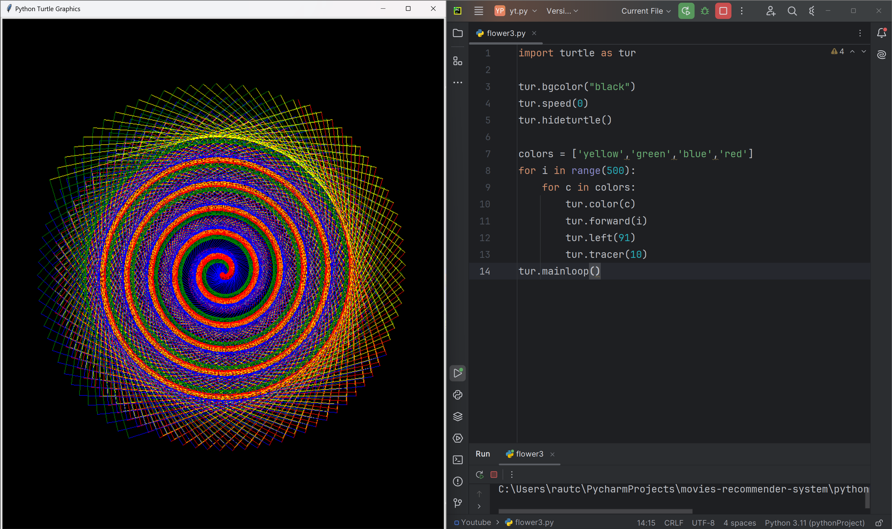

# Cosmic Spiral

This code uses the Python Turtle library to create a stunning, colorful spiral pattern that appears to swirl and twirl like a cosmic whirlpool. The pattern is formed by drawing a series of connected lines with increasing lengths, with each line being drawn in a different color from the colors list. The hideturtle() function is used to hide the turtle, making the pattern more visually appealing.

# Tutorial is available on youtube channel 
click on the link to see :- ([Open in Youtube]())

# Screenshot

Rainbow-Spiral

# Features
Colorful spiral: The pattern features a vibrant, colorful spiral that appears to swirl and twirl like a cosmic whirlpool.
Increasing complexity: The spiral pattern becomes increasingly complex as the lines get longer, creating a sense of depth and movement.
Fast rendering: The speed(0) function is used to render the pattern quickly, making it appear more dynamic and engaging.

# Run
To run this code, save it to a file with a .py extension (e.g., cosmic_spiral.py) and execute it using Python (e.g., python cosmic_spiral.py). This will launch a window displaying the Cosmic Spiral pattern.

# License
This code is licensed under the MIT License. Feel free to modify, distribute, and use it for any purpose.

# snake.coding
We create a project each 4 days with voting on our <a href="https://youtube.com/@snakecoding_12" target="_blank">Youtube</a> channel.
You can vote for upcoming projects on our channel **community** page :wink:

